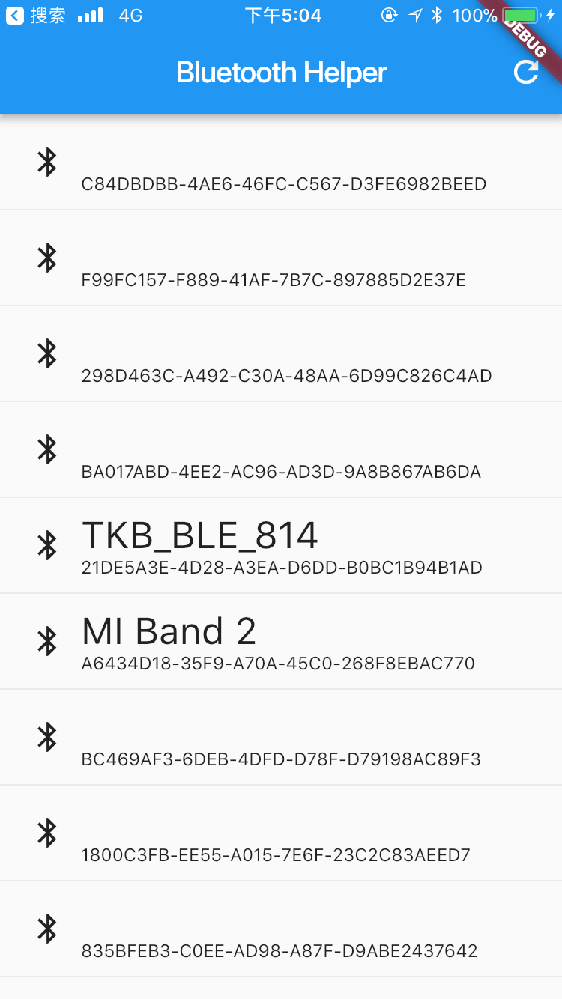
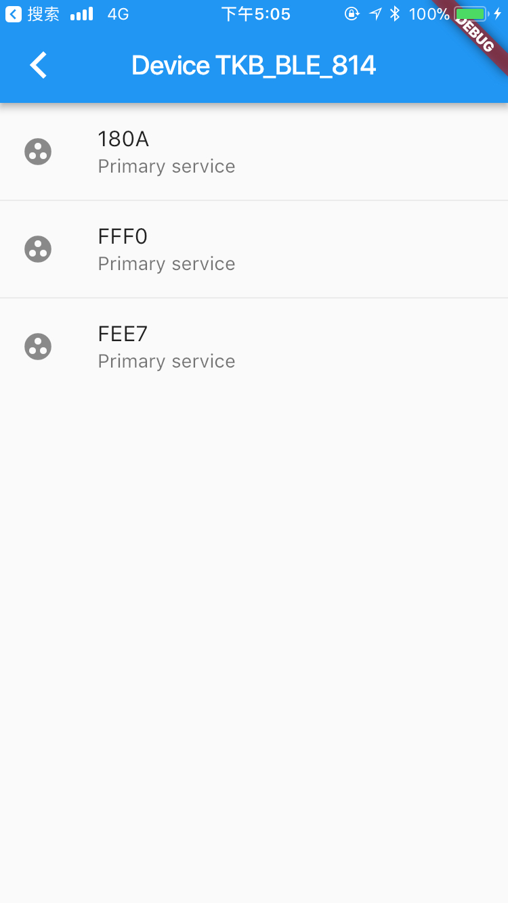
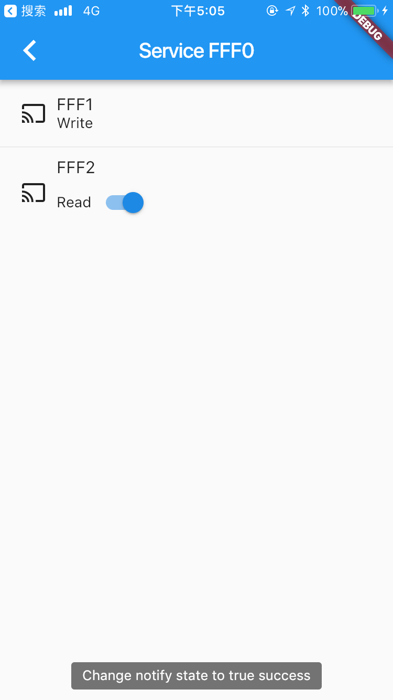
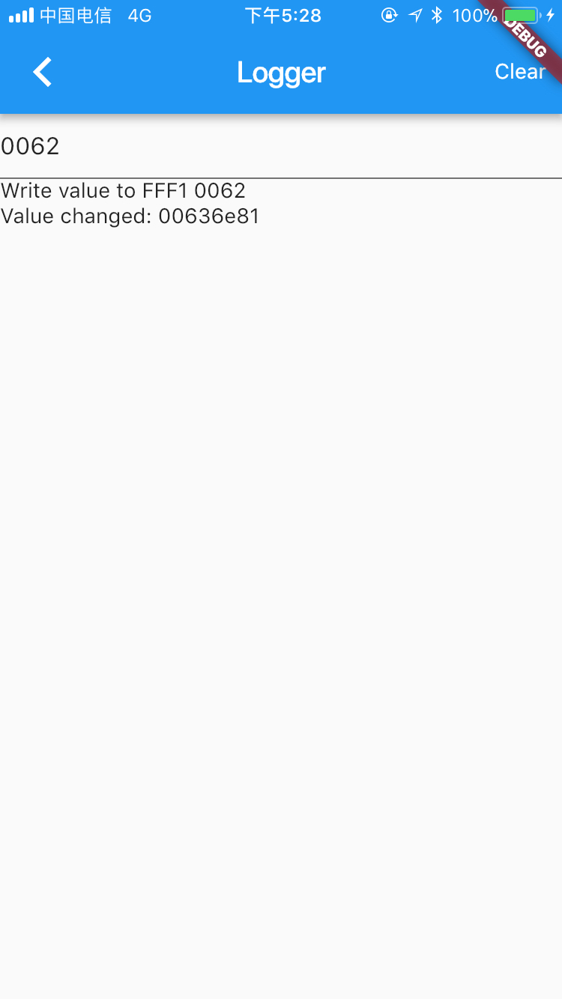

# flutter_wechat_ble

A ble library with wechat api style for flutter.

微信api风格的蓝牙库

## Example









## 安装

加入依赖:

```
flutter_wechat_ble: any
```

导入

```
import 'package:flutter_wechat_ble/flutter_wechat_ble.dart';
```

## 使用

参考下面的文档，因为语言不一样，所以在调用上略有区别:

https://developers.weixin.qq.com/miniprogram/dev/api/wx.readBLECharacteristicValue.html


#### 全局错误码

在使用本库的时候，所有的错误都可以使用如下的形式来捕获


```
try {
  await FlutterWechatBle.someMethod();
} on BleError catch (e) {
   //// 这里捕获了BleError，表示蓝牙操作发生了异常
   print("错误码 ${e.code} 错误信息 ${e.message}");
}
```


具体的错误码含义如下:

```
String get message {
    switch (code) {
      case "10000":
        return "openBluetoothAdapter not called yet!";
      case "10001":
        return "Bluetooth is not opened!";
      case "10002":
        return "Cannot find device id ";
      case "10003":
        return "Connection fail";
      case "10004":
        return "Cannot find service";
      case "10005":
        return "CHARACTERISTIC  not found";
      case "10006":
        return "No connection found";
      case "10007":
        return "Property not support";
      case "10008":
        return "System error!";
    }
  }
```

这里的错误码定义与微信小程序的错误定义一致，也可以参考这里:
https://developers.weixin.qq.com/miniprogram/dev/api/wx.readBLECharacteristicValue.html


#### 集成:

ios需要注意的是在info.plist中增加权限:

```
<key>NSBluetoothPeripheralUsageDescription</key>
<string>请求访问蓝牙</string>
```


#### 打开蓝牙

```
await FlutterWechatBle.openBluetoothAdapter();
```

注意本库并不对权限做出检查。

#### 关闭蓝牙

```
await FlutterWechatBle.closeBluetoothAdapter();
```

#### 扫描外设:

```
await FlutterWechatBle.startBluetoothDevicesDiscovery();
```


#### 监听外设扫描结果

```
 FlutterWechatBle.onBluetoothDeviceFound((BleDevice device){
    //找到了一个外设
 });
```

BleDevice为扫描的结果，包含一个设备的描述信息

```
  /// uuid of the device
  final String deviceId;

  /// device name
  final String name;

  /// RSSI
  final String RSSI;
```


如果不想监听，则调用

```
FlutterWechatBle.onBluetoothDeviceFound(null)
```
将监听函数设置null即可


#### 停止扫描外设

```
await FlutterWechatBle.stopBluetoothDevicesDiscovery();

```


#### 连接外设

```
await FlutterWechatBle.createBLEConnection(deviceId: device.deviceId)
```

这里的deviceId为上面的监听函数结果BleDevice的一个属性

#### 断开外设

```
await FlutterWechatBle.closeBLEConnection(deviceId: device.deviceId);
```

#### 获取服务

```
List<BleService> services = await FlutterWechatBle.getBLEDeviceServices(deviceId: device.deviceId);
```

BleService的属性:
```
 /// uuid of the service
  final String uuid;

  /// always true in android and the `isPrimary` field of the class `CBService` in ios
  final bool isPrimary;
```


#### 获取服务的特征

```
 Future<List<BleCharacteristic>> characteristics = await FlutterWechatBle.getBLEDeviceCharacteristics(
                                                                   deviceId: device.deviceId, serviceId: service.uuid));
```
参数分别为:deviceId和serviceId,

serviceId为上面BleService的字段uuid

BleCharacteristic的属性:


```
  /// uuid of the characteristic
  final String uuid;

  /// support read
  final bool read;

  /// support write
  final bool write;

  /// support notify
  final bool notify;

  /// support indicate
  final bool indicate;
```

与小程序略有区别，将属性直接放在BleCharacteristic这个类下面，使用更加方便


#### 修改notify值

```

await FlutterWechatBle.notifyBLECharacteristicValueChange(
              deviceId: device.deviceId,
              serviceId: service.uuid,
              characteristicId: characteristic.uuid,
              state: true)

```

注意这个方法只能用于支持notify的特征调用。


#### 写入值

```
 await FlutterWechatBle.writeBLECharacteristicValue(
        deviceId: device.deviceId,
        serviceId: service.uuid,
        characteristicId: characteristic.uuid,
        value: 写入值的十六进制字符串或者十六进制数组);
```

这里的value可以为List<int> 或者 十六进制字符串,如果对这些概念不熟悉，可以参考这里：

https://baike.baidu.com/item/%E5%8D%81%E5%85%AD%E8%BF%9B%E5%88%B6/4162457?fr=aladdin


#### 读取值

```
BleValue value =  await FlutterWechatBle.readBLECharacteristicValue(
                       deviceId: device.deviceId,
                       serviceId: service.uuid,
                       characteristicId: characteristic.uuid
                     )
```

BleValue的属性:

```
 final String deviceId;
  final String serviceId;
  final String characteristicId;
  final String value;
```

这里的value为十六进制字符串，如果要得到十六进制数组,则可以使用

```
value.bytes
```


#### 监听值改变

```
 FlutterWechatBle.onBLECharacteristicValueChange((BleValue value){

 });
```

如果需要停止监听:

```
FlutterWechatBle.onBLECharacteristicValueChange(null)
```

设置为null即可


